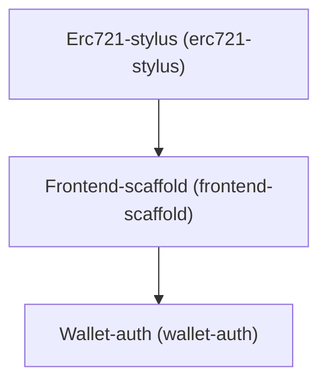

# Architecture

## Dependency Graph

```mermaid
graph TD
  fc2c1d89["Erc721-stylus (erc721-stylus)"]
  1dafd213["Frontend-scaffold (frontend-scaffold)"]
  2b8594a5["Wallet-auth (wallet-auth)"]
  fc2c1d89 --> 1dafd213
  1dafd213 --> 2b8594a5
```

## Execution / Implementation Order

1. **Erc721-stylus** (`fc2c1d89`)
2. **Frontend-scaffold** (`1dafd213`)
3. **Wallet-auth** (`2b8594a5`)
